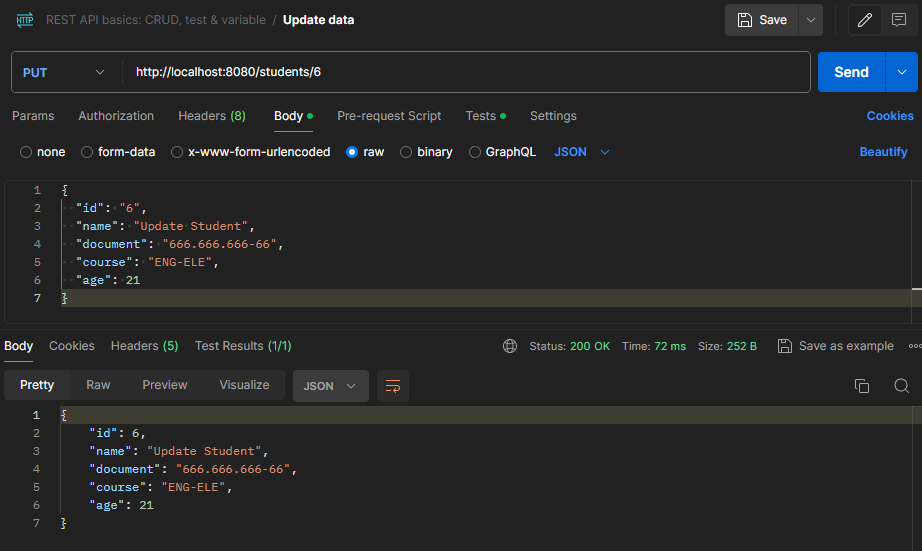

# AULA 4
##  Inversão de controle e injeção de dependencias

### A classe [Student](/src/main/java/arqweb/aula03/demo/model/Student.java)
```
    src > main > java >arqweb.aula03.demo > model
```
### A classe [StudentController](/src/main/java/arqweb/aula03/demo/controller/StudentController.java) foi adicionada a:
``` 
    src > main > java >arqweb.aula03.demo > controller
```

### A interface [StudentService](/src/main/java/arqweb/aula03/demo/services/StudentService.java) e a classe [StudentServiceImpl](/src/main/java/arqweb/aula03/demo/services/StudentServiceImpl.java) foi adicionada a:
``` 
    src > main > java >arqweb.aula03.demo > services
```

### A interface [StudentRepository](/src/main/java/arqweb/aula03/demo/repository/StudentRepository.java) e a classe [StudentRepositoryImpl](/src/main/java/arqweb/aula03/demo/repository/StudentRepositoryImpl.java) foi adicionada a:
``` 
    src > main > java >arqweb.aula03.demo > repository
```
<hr>

### Teste 1 GET - Buscar todos Alunos "/students"

<hr>

### Teste 2 GET - Buscar aluno pelo Id "/students/{id}"

<hr>

### Teste 3 POST - Adicionar aluno "/students/add"

<hr>

### Verificação Teste 3 GET após o POST

<hr>

### Teste 4 DEL - deletar aluno pelo id "/students/{id}"

<hr>

### Verificação Teste 4 GET após o DEL

<hr>

### Teste 5 PUT - alterar dados do Aluno pelo id "/students/{id}"

<hr>

### Verificação Teste 5 GET após o PUT
