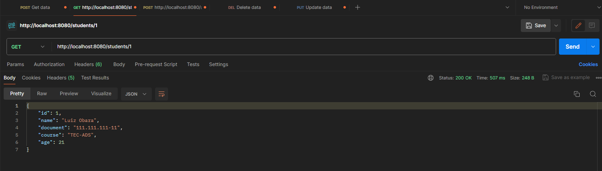
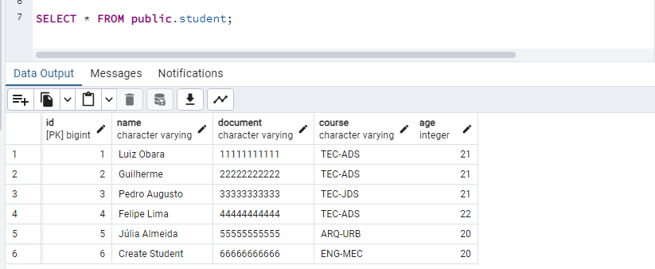

# AULA 5
##  API usando JDBC para persistencia

#### O código do banco e tabela do [Postgre] (/src/main/resourses/db/database.sql)
```
    src > main > resourses > db > database.sql
```
<hr>

### Inserts de dados no banco para testes.

<hr>

### Tabela de estudantes.

<hr>

### Teste do getAllStudents

<hr>

### Teste de getStudentById

<hr>

### Teste do CreateStudent

<hr>

### Save do Post

<hr>

### Teste de updateStudentById

<hr>

### Save do updateStudentById

<hr>

### Teste de deleteStudentById

<hr>

### deleteStudentById

<hr>


# Última atualização - 21/03/2024